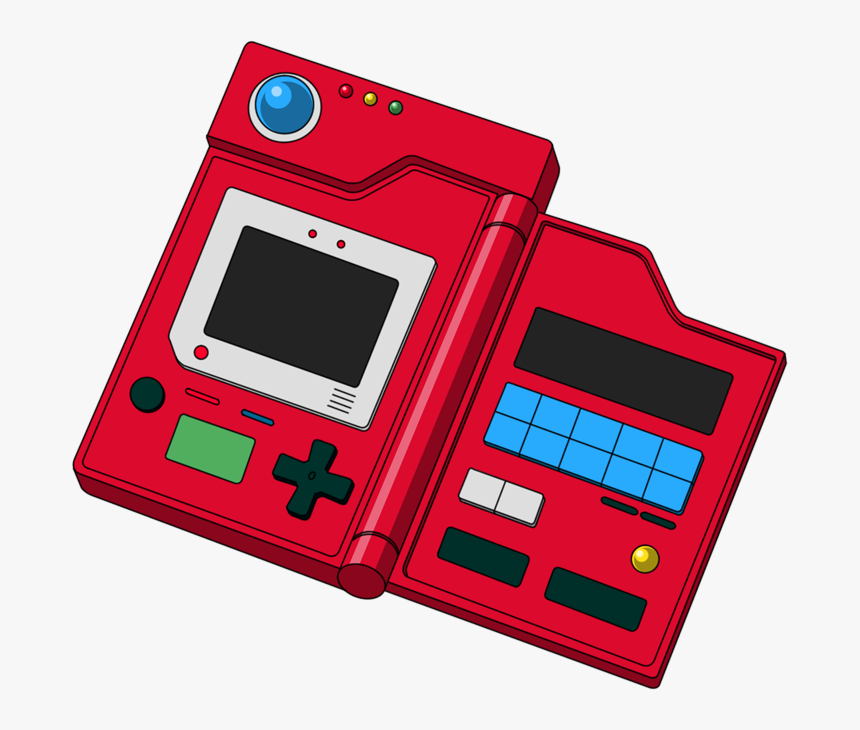

# pokedex
Pokedex

Trabalhando com design responsivo e com a pokeapi(api de pokedex).
Adiconando automaticamente os pokemon com fetch, de acordo com a quantidade que o usuário colocar.

Entre na pokedex clicando <a href="https://joao-vi10r.github.io/pokedex/">aqui</a>
